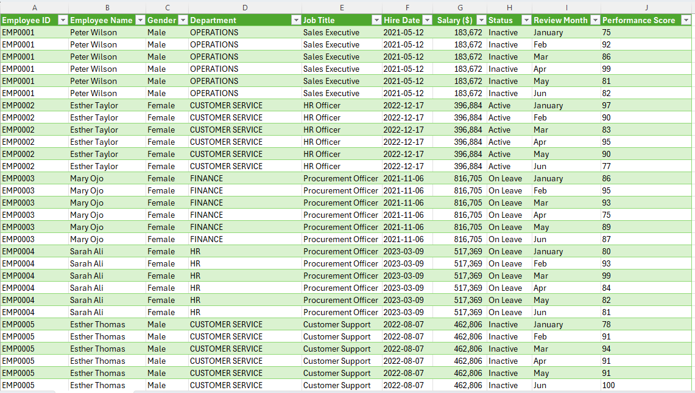

# HR Data Cleaning & Automation Project
 

This repository contains an end-to-end data pipeline built in Excel Power Query. I took a raw, messy HR export containing employee details amd six months of performance data, cleaned up the formatting bugs, and restructured the table so it is readyfor corporate reporting.

The entire pipeline is fully automated. When next month's data drops, a user can click "Data > Refresh All" to clean it instantly.

## The Problems I solved

###  1. Fixing the Missing Salary Data (Nulls)
While profiling the data, I noticed that 49 employees had null values in the salary column. However, these same employees had active performance scores from January to June, meaning they were actively working.

* **The Fix:** Deleting these rows would break our headcount metrics, and leaving them as blank/0 would mess up department salary averages. I calculated the company's true average salary ($543,853) and used Power Query to replace the nulls with this baseline. This kept our headcount accurate without skewing the financial metrics. 

###  2. Restructuring the Performanace Metrics(The Unpivot)
The original file had performance scores spread sideways across six separate columns(Jan, Feb, Mar, Apr, May, Jun). While this looks fine to the human, it ruins a database. You cannot easily write averages, filter by month, or make a dynamic trend chart when data is formatted horizontally.

* **The Fix:** I selected the month columns and used the Unpivot tool. This collapsed the wide columns into two clean vertical columns: Review Month and Performance Score. Now, each employee has 6 consecutive rows (one for each month), making it incredibly easy to plug into Pivot Table or chart.

 ## Business Impact
 * **Hours Saved:** Replaced a highly repetitive spreadsheet scrubbing routine with a 1- click automated refresh.
 * **Better Reporting:** By restructuring the performance metrics vertically, leadership can now use a single dropdown slicer to look at monthly trends across departments instantly.
